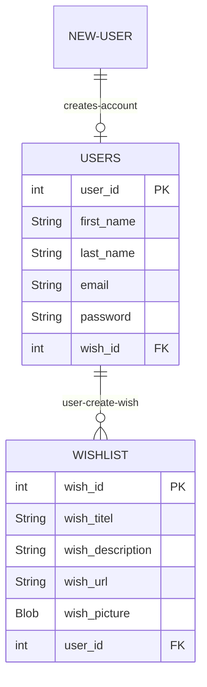
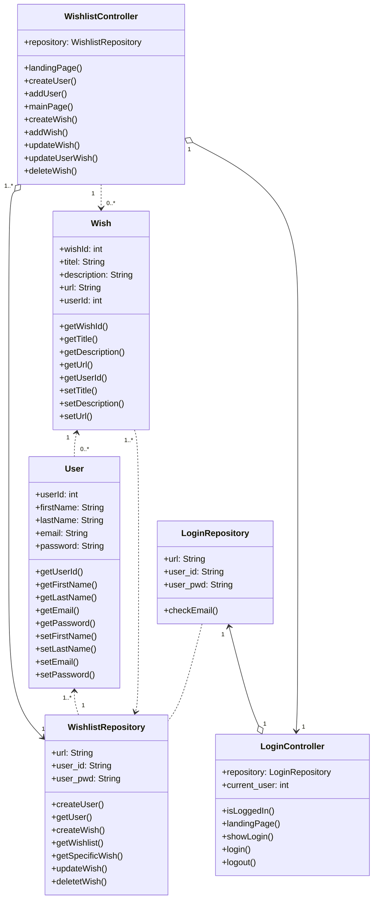

# Contribute - Wishlist Project

### Introduction
The purpose of the project is to enhance your skills within some of the subject elements that are included in the exam project. The mini-project provides you with the opportunity to work problem-based and interdisciplinary with requirements, design, and implementation of a web-based database application.

<br> 

## ER-Diagram Wishlist project

<br>



<br>
<br>

## Tables
In our project we have 2 tables, that we are working with. A table that includes all information about each individual wish and one that holds all user information. In the snippet below, you can see how the tables have been set up in MySQL.
```
CREATE TABLE users
(
    user_id       INTEGER NOT NULL AUTO_INCREMENT,
    first_name    VARCHAR(20),
    last_name     VARCHAR(20),
    user_email    VARCHAR(50) UNIQUE,
    user_password VARCHAR(50),
    PRIMARY KEY (user_id)
);

CREATE TABLE wishlist
(
    wish_id          INTEGER NOT NULL AUTO_INCREMENT,
    wish_title       VARCHAR(50),
    wish_description VARCHAR(255),
    wish_url         VARCHAR(2083),
    wish_picture     BLOB,
    user_id          INTEGER,
    PRIMARY KEY (wish_id),
    FOREIGN KEY (user_id) REFERENCES users (user_id)
);
```

As you can see, 'users' contains all the user information, that is asked to fill out when you create an account. Our primary key is set us as being the user_id, which we uses frequently to check their login and as a way to navigate the page. Also it is setup to never be null, meaning if nothing is set on the value, it will just add +1 to the latest value in the table.

The 'wishlist' table is set up with all the information needed about the wish. Wishes are also set up to have an id, in the same way users do. This value is also set to never be null. Other than that, as you can see 'wishlist' includes a title, description, url and a picture, which we did not put that much use for unfortunatly. In this table, 'wish_id' is our primary key. The 'wishlist' table also includes user_id, and is referenced to be the same as whatever it is in the 'users' table.

### Classes and Setup

Sign-up:
When signing up it's requirede to enter; first name, last name, email and password.

These information will be taken by the class **wishlistController** where createUser methode will create a new instance of a user and send it to the html-page "create-user"

```java
    @GetMapping("/create")
    public String createUser(Model model){
        User newUser = new User();
        model.addAttribute("newUser", newUser);
        return "create-user";
    }
```

After the instance has been filled with the users informations the methode:

```java
    @PostMapping("/adduser")
    public String addUser(@ModelAttribute User newUser, Model model){
        int userId = wishlistRepository.createUser(newUser);
        return "created-user";
    }
```

## Class Diagram Wishlist project
<br>


<br>


