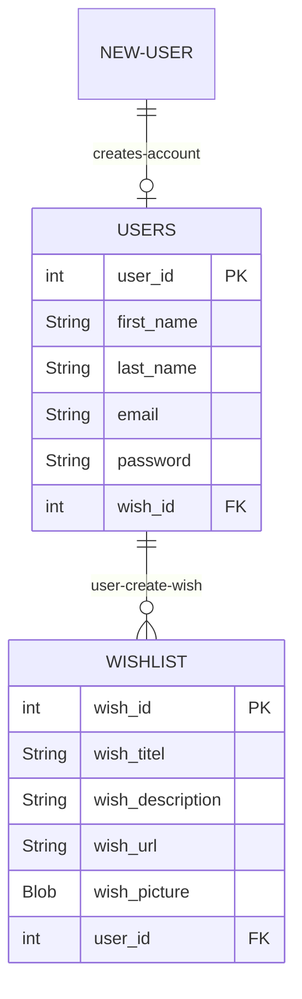
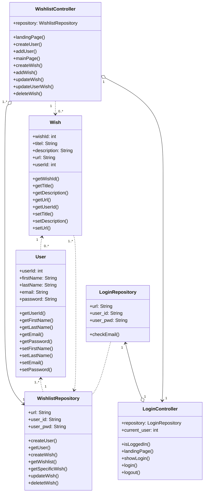

# Contribute - Wishlist Project

### Introduction
The purpose of the project is to enhance your skills within some of the subject elements that are included in the exam project. The mini-project provides you with the opportunity to work problem-based and interdisciplinary with requirements, design, and implementation of a web-based database application.

<br> 

## ER-Diagram Wishlist project

<br>



<br>
<br>

## Tables
In our project we have 2 tables, that we are working with. A table that includes all information about each individual wish and one that holds all user information. In the snippet below, you can see how the tables have been set up in MySQL.
```
CREATE TABLE users
(
    user_id       INTEGER NOT NULL AUTO_INCREMENT,
    first_name    VARCHAR(20),
    last_name     VARCHAR(20),
    user_email    VARCHAR(50) UNIQUE,
    user_password VARCHAR(50),
    PRIMARY KEY (user_id)
);

CREATE TABLE wishlist
(
    wish_id          INTEGER NOT NULL AUTO_INCREMENT,
    wish_title       VARCHAR(50),
    wish_description VARCHAR(255),
    wish_url         VARCHAR(2083),
    wish_picture     BLOB,
    user_id          INTEGER,
    PRIMARY KEY (wish_id),
    FOREIGN KEY (user_id) REFERENCES users (user_id)
);
```

As you can see, 'users' contains all the user information, that is asked to fill out when you create an account. Our primary key is set us as being the user_id, which we uses frequently to check their login and as a way to navigate the page. Also it is setup to never be null, meaning if nothing is set on the value, it will just add +1 to the latest value in the table.

The 'wishlist' table is set up with all the information needed about the wish. Wishes are also set up to have an id, in the same way users do. This value is also set to never be null. Other than that, as you can see 'wishlist' includes a title, description, url and a picture, which we did not put that much use for unfortunatly. In this table, 'wish_id' is our primary key. The 'wishlist' table also includes user_id, and is referenced to be the same as whatever it is in the 'users' table.
<br>
<br>

## Classes and Setup

In this project there are 6 classes.
- Model classes
  - Wish
  - User
- Controllers
  - LoginController
  - WishlistController
- Repositories
  - LoginRepository
  - WishlistRepository

### Sign-up
When signing up it's requirede to enter; first name, last name, email and password.

These information will be taken by the class **wishlistController** where createUser method will create a new instance of a user and send it to the html-page "create-user"

```java
    @GetMapping("/create")
    public String createUser(Model model){
        User newUser = new User();
        model.addAttribute("newUser", newUser);
        return "create-user";
    }
```

After the instance has been filled with the users informations and the user presses the 'Submit' button, the url "created-user" will be called and **addUser** method from the controller will add the user to the table.

```java
    @PostMapping("/adduser")
    public String addUser(@ModelAttribute User newUser, Model model){
        int userId = wishlistRepository.createUser(newUser);
        return "created-user";
    }
```
The controller method **addUser** is calling our method **createUser** method from our repository. The snippet below contains this method.

```java
    public int createUser(User newUser) {
        int userId = 0;
        try (Connection con = DriverManager.getConnection(url, user_id, user_pwd)) {
            String SQL = "INSERT INTO users (first_name, last_name, user_email, user_password) values (?,?,?,?)";
            PreparedStatement pstmt = con.prepareStatement(SQL, Statement.RETURN_GENERATED_KEYS);
            pstmt.setString(1, newUser.getFirstName());
            pstmt.setString(2, newUser.getLastName());
            pstmt.setString(3, newUser.getEmail());
            pstmt.setString(4, newUser.getPassword());
            pstmt.executeUpdate();

            ResultSet rs = pstmt.getGeneratedKeys();
            if(rs.next()){
                userId = rs.getInt(1);
            }

        } catch (SQLException e) {
            throw new RuntimeException(e);
        }
        return userId;
    }
```
The method retrieves the generated keys *first_name, last_name, user_email and user_password* and fills them into our SQL statement. The *user_id* will be automatically generated, taking the latest id into account.

### Sign-in
When signing in you have to put in your email and a password. Then when the sign-in button is pressed, our **login** method is called from our ***LoginController*** class.
```java
    @PostMapping("/login")
    public String login(@RequestParam("uid") String uid, @RequestParam("pw") String pw, HttpSession session, Model model) {
        User user = loginRepository.checkEmail(uid);
        if (user != null && user.getPassword().equals(pw)) {
            // create session for user and set session timeout to 30 sec (container default: 15 min)
            session.setAttribute("user", user);
            current_userId = user.getUserId();

            session.setMaxInactiveInterval(30);

            return "redirect:/wishlist/mainpage/" + current_userId;
        }

        // wrong credentials
        model.addAttribute("wrongCredentials", true);
        return "login";
    }
```
First the method creates an instance of "User" that uses our method **checkEmail** from our ***LoginRepository*** class. This method will be explained further down. After the instance of a User has been retrieved from the method, it goes into an if-statement that checks whether or not a user is found and if the password and email matches together.
If they match, the user will be logged in and sent to their homepage, which is their page with all their wishes.

In the snippet below you will see the code for the method **checkEmail**.
```java
    public User checkEmail(String email){
        User user = new User();
        try (Connection con = DriverManager.getConnection(url, user_id, user_pwd)) {
            String SQL = "SELECT * FROM users WHERE user_email = ?";
            PreparedStatement pstmt = con.prepareStatement(SQL);
            pstmt.setString(1,email);
            ResultSet rs = pstmt.executeQuery();

            if(rs.next()){
                user.setUserId(rs.getInt("user_id"));
                user.setPassword(rs.getString("user_password"));
            }

            return user;

        } catch (SQLException e) {
            throw new RuntimeException(e);
        }
    }
```
This method sends an SQL statement to the database that takes all the login information about a user according to the email they have put in when loggin in. If a user is found with the email it will set the id and password of the user and return it. After this the controller method does the rest with it's if-statement.

### Check if logged in
When a user opens up our webpage, the program will check whether or not the user is logged in. If a user tries to open up their main page without being logged in, they will be sent to the login page. This is done by the method **isLoggedIn** from the ***LoginController*** class.
```java
    protected boolean isLoggedIn(HttpSession session, int uid) {
        return session.getAttribute("user") != null && current_userId == uid;
    }
```
The method checks if a user object is returned as not null and it also checks if the user_id for the page matches the logged in user_id. If this all matches, the user will be able to see their main page. This is done by returning a boolean value.

### List of wishes
When a user has logged in they will be sent to their main page which has all their created wishes listed. This is done by a method **getWishList** from the ***WishlistRepository*** class.
```java
    public List<Wish> getWishList(int usersId){
        List<Wish> wishList = new ArrayList<>();
        try(Connection con = DriverManager.getConnection(url,user_id,user_pwd)) {
            String SQL = "SELECT * FROM wishlist WHERE user_id = ?";
            PreparedStatement pstmt = con.prepareStatement(SQL);
            pstmt.setInt(1, usersId);
            ResultSet rs = pstmt.executeQuery();

            while(rs.next()){
                int wishId = rs.getInt("wish_id");
                String title = rs.getString("wish_title");
                String description = rs.getString("wish_description");
                String url = rs.getString("wish_url");
                int id = rs.getInt("user_id");

                wishList.add(new Wish(wishId,title,description,url,id));
            }

        } catch (SQLException e) {
            throw new RuntimeException(e);
        }
        return wishList;
    }
```
This method calls an SQL statement that takes all the wishes from the table with user_id taken into account. It retrieves all the information about every individual wish and creates a new instance of "Wish" and adds it to an ArrayList. This ArrayList is then returned in the end. The rest is done by the method **mainPage** in the controller.
```java
    @GetMapping("/mainpage/{uid}")
    public String mainPage(@PathVariable int uid, Model model, HttpSession session){
        User user = wishlistRepository.getUser(uid);

        model.addAttribute("userId", user.getUserId());
        model.addAttribute("firstName", user.getFirstName());
        model.addAttribute("lastName", user.getLastName());

        List<Wish> wishList = wishlistRepository.getWishList((uid));
        model.addAttribute("wishlist", wishList);

        return loginController.isLoggedIn(session, uid) ? "main-page" : "login";
    }
```
This method retrieves user_id, first name and last name and then the ArrayList of wishes that matches the users user_id, which then the HTML page handles.

### Add wish
When adding a wish to your wishlist you need to press "add wish" button on your own home page. When this button is pressed, the page "create-wish" will open and the user can fill out informations about the wish including *title, description and url*. This also calls our method **createWish** from our controller.

```java
    @GetMapping("/createwish/{uid}")
    public String createWish(@PathVariable int uid, Model model){
        Wish newWish = new Wish();
        newWish.setUserId(uid);
        model.addAttribute("newWish", newWish);
        return "create-wish";
    }
```
This method creates an empty instance of the ***Wish*** class and takes the user_id of the current user to add to the table.
When the user presses the button "Submit" the **addWish** method from the controller will now be called, which can be seen below.
```java
    @PostMapping("/addwish")
    public String addWish(@ModelAttribute Wish newWish){
        wishlistRepository.createWish(newWish);
        return "redirect:/wishlist/mainpage/" + newWish.getUserId();
    }
```
This method will call our method **createWish** from our ***WishlistRepository*** class. This method can be seen below.
```java
    public void createWish(Wish newWish){
        try(Connection con = DriverManager.getConnection(url,user_id,user_pwd)) {
            String SQL = "INSERT INTO wishlist(wish_title, wish_description, wish_url, user_id) VALUES(?, ?, ?, ?)";
            PreparedStatement pstmt = con.prepareStatement(SQL);
            pstmt.setString(1,newWish.getTitle());
            pstmt.setString(2,newWish.getDescription());
            pstmt.setString(3,newWish.getUrl());;
            pstmt.setInt(4,newWish.getUserId());

            pstmt.executeUpdate();

        } catch (SQLException e) {
            throw new RuntimeException(e);
        }
    }
```
The method retrieves the information about the wish and puts it into the SQL statement, which then puts it onto the table. The user_id is retrieved from the empty instance of Wish that was made.

### Update and delete wish
In the program you will also find an edit function for your wishes and a delete function. The edit is found when you press "edit wish" on a specific wish in the list on the home page. When the button is pressed, it calls **updateWish** method in the controller.
```java
    @GetMapping("/updatewish/{wid}")
    public String updateWish(@PathVariable int wid, Model model){
        Wish updateWish = wishlistRepository.getSpecificWish(wid);
        model.addAttribute("updateWish", updateWish);
        return"update-wish";
    }
```
This controller method uses another method **getSpecificWish** from our repository, which returns a wish object. You can see the code below

```java
    public Wish getSpecificWish(int wishId){
        Wish wishFound = null;
        try(Connection con = DriverManager.getConnection(url,user_id,user_pwd)){
            String SQL = "SELECT * FROM wishlist WHERE wish_id = ?";
            PreparedStatement pstmt = con.prepareStatement(SQL);
            pstmt.setInt(1,wishId);

            ResultSet rs = pstmt.executeQuery();
            if(rs.next()){
                wishFound = new Wish(
                        rs.getInt("wish_id"),
                        rs.getString("wish_title"),
                        rs.getString("wish_description"),
                        rs.getString("wish_url"),
                        rs.getInt("user_id"));

            }
            return wishFound;

        } catch(SQLException e){
            throw new RuntimeException(e);
        }
    }
```
This method uses an SQL statement that gathers all the information about a wish according to the wish_id. The wish_id is retrieved as soon as the user presses on the update wish button. This is why the method has an attribute "int wishId" to it.

When a wish has been found with the matching wish_id, it will gather all the information about this wish and send it out as a wish object. This object will then be displayed in a box, just like when you add a new wish to your list. Here you will just be able to edit the already existing information about the selected wish.

When the needed changes has been made to a wish, the user will need to press the "Submit" button. This will call the **updateUserWish** method from the controller.
```java
    @PostMapping("/updatewish")
    public String updateUserWish(@ModelAttribute Wish wishUpdate){
        wishlistRepository.updateWish(wishUpdate);
        return "redirect:/wishlist/mainpage/" + wishUpdate.getUserId();
    }
```
This method uses another method **updateWish** from the repository.
```java
    public void updateWish(Wish wish){
        try(Connection con = DriverManager.getConnection(url,user_id,user_pwd)) {
            String SQL = "UPDATE wishlist SET wish_title=?, wish_description=?, wish_url=? WHERE wish_id = ?;";
            PreparedStatement pstmt = con.prepareStatement(SQL);
            pstmt.setString(1,wish.getTitle());
            pstmt.setString(2,wish.getDescription());
            pstmt.setString(3,wish.getUrl());
            pstmt.setInt(4,wish.getWishId());

            pstmt.executeUpdate();

        } catch (SQLException e){
            throw new RuntimeException(e);
        }
    }
```
What this method does, is executing an SQL statement "UPDATE", that uses the gathered information from the previous form. Whatever changes the user has made for the wish, the method will then grab and put into the statement, which then will update the table.
<br>
<br>
Deleting a wish is rather simple. On all wishes listed on the home page there will be a button for deleting the specific wish. That works with a **deleteWish** method from the controller is called.
```java
    @GetMapping("/deletewish/{uid}/{wid}")
    public String deleteWish(@PathVariable int uid, @PathVariable int wid){
        wishlistRepository.deleteWish(wid);
        return "redirect:/wishlist/mainpage/" + uid;
    }
```
This uses another method **deleteWish** from the repository.

```java
    public void deleteWish(int wishId){
        try(Connection con = DriverManager.getConnection(url,user_id,user_pwd)) {
            String SQL = "DELETE FROM wishlist WHERE wish_id = ?";
            PreparedStatement pstmt = con.prepareStatement(SQL);
            pstmt.setInt(1, wishId);
            pstmt.executeUpdate();
        } catch (SQLException e) {
            throw new RuntimeException(e);
        }
    }
```
The **deleteWish** method from the repository executes the "DELETE" function in an SQL statement. Since the wish_id is unique, thats all the information we have to give SQL for it to delete the correct wish. It gathers the wish_id from the controller and executes the command.

## Class Diagram Wishlist project
<br>


<br>


