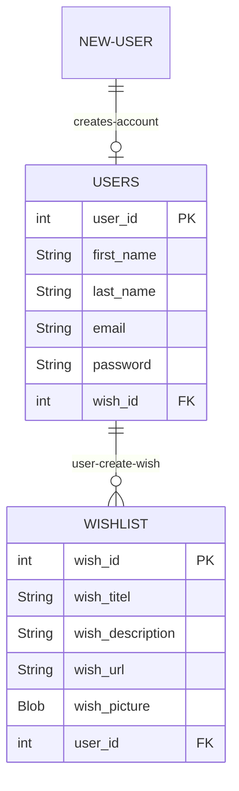
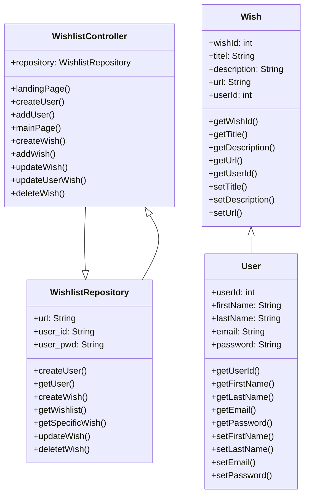

# Contribute - Wishlist Project

### Introduction
The purpose of the project is to enhance your skills within some of the subject elements that are included in the exam project. The mini-project provides you with the opportunity to work problem-based and interdisciplinary with requirements, design, and implementation of a web-based database application.

 

## ER-Diagram Wishlist project

 

 

## Class Diagram Wishlist project

 

