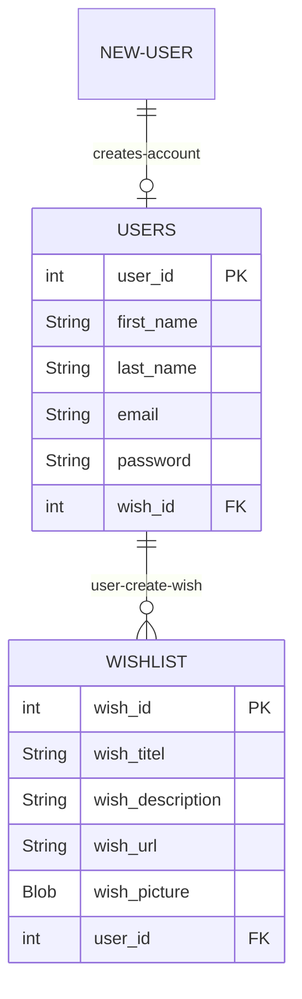
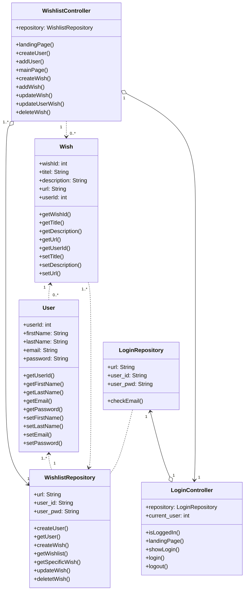

# Contribute - Wishlist Project

### Introduction
The purpose of the project is to enhance your skills within some of the subject elements that are included in the exam project. The mini-project provides you with the opportunity to work problem-based and interdisciplinary with requirements, design, and implementation of a web-based database application.

<br> 

## ER-Diagram Wishlist project

<br>



<br>
<br>

### Classes and Setup

Sign-up:
When signing up it's requirede to enter; first name, last name, email and password.

These information will be taken by the class **wishlistController** where createUser methode will create a new instance of a user and send it to the html-page "create-user"

```java
    @GetMapping("/create")
    public String createUser(Model model){
        User newUser = new User();
        model.addAttribute("newUser", newUser);
        return "create-user";
    }
```

After the instance has been filled with the users informations the methode:

```java
    @PostMapping("/adduser")
    public String addUser(@ModelAttribute User newUser, Model model){
        int userId = wishlistRepository.createUser(newUser);
        return "created-user";
    }
```

## Class Diagram Wishlist project
<br>


<br>


